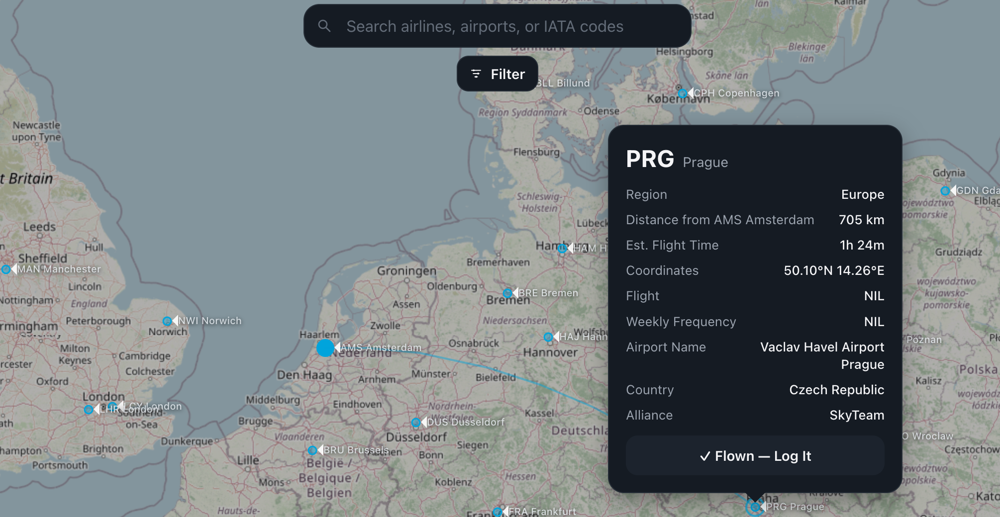

# SkyDex 航線圖鑑

多家航空公司航點資料整合的視覺化地圖工具，讓航線距離、轉機替代方案一目了然。

**🔗 Demo:** https://shao-t.github.io/-SkyDex-/


<!-- 這裡換成一張你工具的實際截圖，路徑對到 assets 資料夾裡的圖片檔名 -->

## 這是什麼

目前市面上少有能把多家航空公司航點整合在同一張地圖上、又能直覺比較距離與替代路線的工具。SkyDex 把這件事做出來了——特別適合：

- 員工票（Staff Travel / ZED）開票時比較轉機組合
- 快速掌握某條航線是否有其他替代路徑
- 一次查看多家航司的航點分佈，而不用一家一家系統切換查詢

## 目前整合的航司

後續會持續加入更多航司資料。

## 技術架構

- 單檔 HTML + [Leaflet.js](https://leafletjs.com/) 地圖渲染
- 純前端部署，透過 GitHub Pages 提供 demo

## 使用方式

直接開啟 [Demo 連結](https://shao-t.github.io/-SkyDex-/) 即可使用，無需安裝。若要本地執行：

```bash
git clone https://github.com/Shao-t/-SkyDex-.git
cd -SkyDex-
# 用任一種靜態伺服器開啟 index.html 即可，例如：
npx serve .
```

## 開發背景

我在航空地勤第一線工作，深知員工票開票找路線的麻煩——同一個目的地常有兩三種轉機組合，哪家有位、哪個轉機距離方便、哪條航線有替代方案，這些資訊分散在各家系統裡。SkyDex 就是為了解決這個問題而做的。

---

## English

**SkyDex** is a route visualization tool that consolidates flight route points from multiple airlines onto a single interactive map — making distances and alternative routings instantly visible.

**🔗 Live demo:** https://shao-t.github.io/-SkyDex-/

Built out of a real need from working in airline ground operations: comparing staff-travel (ZED fare) routing options across carriers is normally scattered across separate systems. SkyDex puts it all on one map.

**Currently covers:** — more carriers to come.

**Stack:** Single-file HTML, Leaflet.js for mapping, Supabase as the data backend, GA4 for usage analytics.

No installation needed — just open the [demo link](https://shao-t.github.io/-SkyDex-/).
